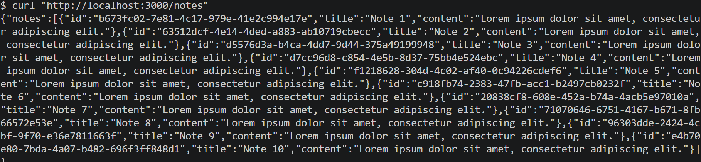
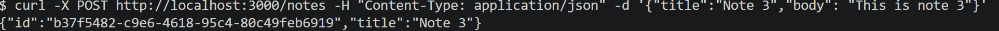
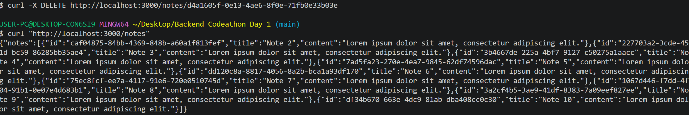

# Notes API

REST API for Notes with all CRUD Operations

## Features

- CRUD operations for notes
- Error Handling

## Stack

- Node.js + Hono
- Typescript

## Installation

```bash
git clone https://github.com/LamestAmos/Notes-API.git
cd Notes-API
npm i
```

## Initialization

```bash
npm run dev
```

## Example Usage

### GET



### POST



### DELETE


